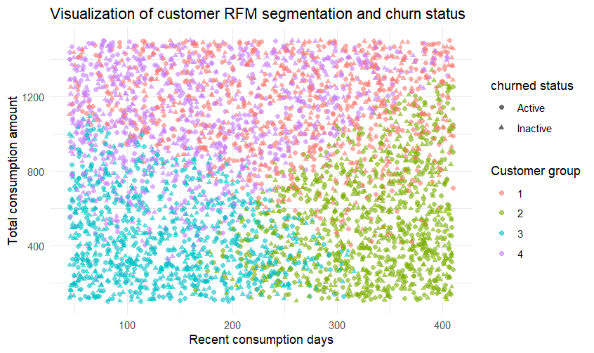

# Foodpanda Customer Churn and Value Analysis

This repository contains a series of analyses on Foodpanda's customer data. The primary goal is to understand and predict customer churn, segment customers based on their value, and derive actionable business insights to improve customer retention and marketing strategies.

## Table of Contents
1.  [Customer Churn Prediction Analysis](#customer-churn-prediction-analysis)
2.  [Customer Segmentation and Value Analysis (RFM)](#customer-segmentation-and-value-analysis-rfm)
3.  [Customer Value and Behavioral Insights (SQL Analysis)](#customer-value-and-behavioral-insights-sql-analysis)
4.  [Overall Conclusions and Future Work](#overall-conclusions-and-future-work)

---

## Customer Churn Prediction Analysis

### 1. Research Objectives
* To predict the likelihood of customer churn by analyzing customer, order, and review data.
* To identify the key factors that influence customer churn.
* To provide data-driven insights for developing effective customer retention strategies.

### 2. Predictive Modeling and Results
Two machine learning models were used for churn prediction: **Logistic Regression** and **LightGBM**.

* **Logistic Regression**: Chosen as a baseline model for its interpretability and computational efficiency.
    * **Result**: The model's performance was poor, with a prediction accuracy of only **50%**. The analysis of deviance showed that the model failed to capture complex patterns in the data.

* **LightGBM**: A more powerful non-linear model was used to handle complex relationships in the data.
    * **Result**: The model showed only a marginal improvement, with an accuracy of **53.9%** and an AUC value of **0.537905**, which is only slightly better than a random guess.

### 3. Analysis of Poor Model Performance
The poor performance of both models was attributed to insufficient feature information in the dataset. A correlation analysis revealed almost no linear relationship between the major variables and customer churn, which explains the failure of both the linear (Logistic Regression) and the more complex non-linear (LightGBM) models.

### 4. Key Business Insights from Churn Analysis
Despite the low predictive accuracy, the models provided valuable business insights:

* **Order Cancellation (`delivery_statusCancelled`)**: This is the **strongest factor** influencing customer churn. A negative experience, especially an order cancellation, is the most direct reason for churn.
    * **Recommendation**: Prioritize investments in optimizing the order management system to reduce cancellations. This is the most effective retention strategy.

* **Customer Rating (`rating`)**: Customer ratings have a significant impact on churn. It's possible that loyal customers churn quickly after a single bad experience, leaving a high negative rating.
    * **Recommendation**: Establish a rapid response mechanism for low-rated orders to proactively contact customers and rebuild trust.

* **Loyalty and Frequency (`loyalty_points`, `order_frequency`)**: These variables showed a negative correlation with churn, meaning customers with high loyalty points and order frequency are less likely to churn.
    * **Recommendation**: Use loyalty programs as a leading indicator for churn risk and offer customized incentives to customers whose engagement is declining.

---

## Customer Segmentation and Value Analysis (RFM)

### 1. Research Objectives
Given the limitations of predictive modeling, the focus shifted from "prediction" to "understanding" and "exploration". The objective was to segment users scientifically using the **RFM (Recency, Frequency, Monetary) model** and the **K-Means clustering algorithm** to better understand different user groups.

### 2. Methodology
* **RFM Model**: Measures customer value based on three metrics:
    * **Recency (R)**: Time since the last purchase (lower is better).
    * **Frequency (F)**: Number of purchases over a period (higher is better).
    * **Monetary (M)**: Total amount spent (higher is better).
* **K-Means Clustering**: An unsupervised learning algorithm used to segment customers into distinct groups based on their RFM scores. The optimal number of clusters was determined to be four using the Elbow Method.

### 3. Customer Segments and Recommendations
Based on our analysis, we segmented customers into four groups. The visualization of the clustering results is as follows:

By analyzing the RFM characteristics of these four segmented groups, we drew the following conclusions:

* **Group 1 (Red): New / Low-Value Active Customers**
    * **Characteristics**: These customers have purchased recently (small Recency value) but have a low total spend (small Monetary value).
    * **Recommendation**: Encourage them to make more repeat purchases with personalized new-user coupons, popular dish recommendations, or limited-time discounts to grow them into higher-value customers.

* **Group 2 (Green): High-Value Churn Risk Customers**
    * **Characteristics**: This group has a very high total spend (largest Monetary value) but has not purchased in a while (large Recency value).
    * **Conclusion**: These customers were once your core revenue source but are now at risk of churning. They are the top priority for retention efforts.
    * **Recommendation**: Launch targeted retention campaigns immediately. Use high-value, personalized initiatives such as exclusive VIP offers, dedicated customer support, or direct contact to understand their reasons for not purchasing again and reactivate their engagement.

* **Group 3 (Blue): Low-Value Churned Customers**
    * **Characteristics**: These customers have a low total spend (small Monetary value) and have not purchased for a long time (largest Recency value).
    * **Conclusion**: This group has limited contribution to the business and has already churned.
    * **Recommendation**: You can use low-cost, bulk marketing strategies (such as email campaigns or push notifications) to occasionally reach out to them. The bulk of retention resources should be focused on more promising groups.

* **Group 4 (Purple): Mid-Value Active Customers**
    * **Characteristics**: These customers have purchased recently (small Recency value) and their total spend is at a moderate level (mid-range Monetary value).
    * **Conclusion**: This group is the stable foundation of your business. They are regular users who provide a consistent stream of revenue.
    * **Recommendation**: Encourage them to increase their spending and frequency through loyalty programs, point rewards, or gamified "spending challenges" to move them toward the high-value customer group.

---

## Customer Value and Behavioral Insights (SQL Analysis)

### 1. Research Objectives
This analysis serves as a follow-up to the previous reports, using direct SQL queries to dive deeper into specific business metrics and gain more precise, actionable insights.

### 2. Key Business Insights from SQL Queries

* **Payment Method and Churn**:
    * **Finding**: The churn rate for **Cash on Delivery (11.3%)** is slightly higher than for **Credit Card (9.8%)** users.
    * **Recommendation**: Encourage Cash on Delivery users to switch to online payment methods to increase their engagement and loyalty.

* **Service Quality and Churn**:
    * **Finding**: The average rating for churned customers (4.38) is slightly **higher** than for active customers (4.37).
    * **Insight**: This counter-intuitive result suggests that customer churn is not solely driven by low satisfaction. Relying only on ratings as a churn indicator is not sufficient. Behavioral data, like a drop in order frequency, may be a more effective warning sign.

* **Churn and Business Growth**:
    * **Finding**: The number of new customers acquired each month is **equal** to the number of customers who churn.
    * **Insight**: This "zero-growth" cycle is a significant warning sign, indicating that the customer retention strategy is lacking.
    * **Recommendation**: Shift resources from pure customer acquisition to customer retention by analyzing churned customer behavior and implementing targeted retention plans.

---

## Overall Conclusions and Future Work

### Conclusions
1.  **Order Cancellation is the Primary Driver of Churn**: Across all analyses, order cancellation consistently emerged as the most direct and forceful cause of customer churn.
2.  **High-Value Customers Pose the Greatest Churn Risk**: The churn of high-value customers represents the most significant potential threat to the business.
3.  **Retention is Key to Growth**: The platform is stuck in a zero-growth cycle where new customer acquisition is cancelled out by churn. A strategic shift towards customer retention is critical for sustainable growth.

### Future Work
* Integrate churn prediction models with customer segments to provide more accurate churn risk assessments for each group.
* Analyze the effectiveness of different marketing strategies on each customer segment.
* Utilize clustering results to provide more personalized product recommendations and ad targeting.
